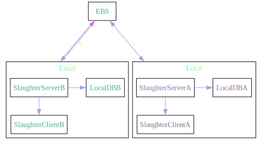
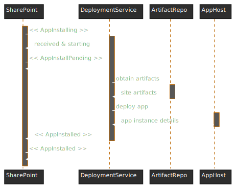
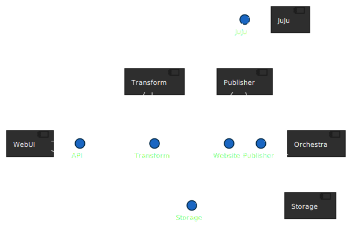
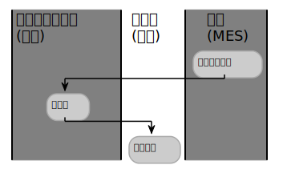
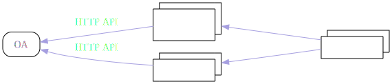
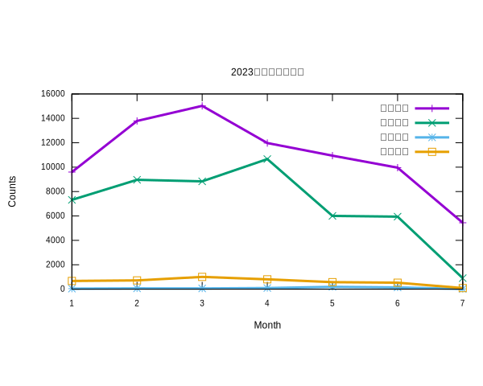
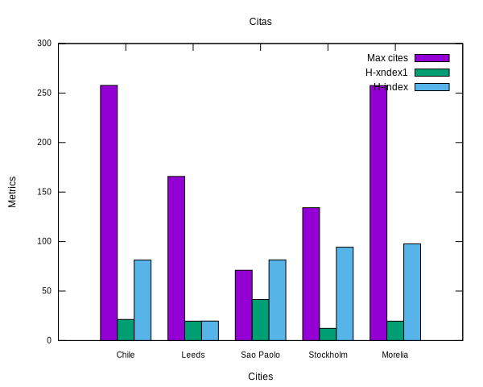

> 样式引用：<https://docs.doomemacs.org/latest/#/modules>  

一个类 **doom doc** 的 **org html** 样式模版 [点此预览🪄](http://1.117.167.195/doc/doomorgstyle.html)  

# 使用

配置 **snippet** 模版，然后在 **org mode** 文件中使用 `tt` `tab` 就可展开此模版。  

    # -*- mode: snippet -*-
    # name: title
    # key: tt
    # --
    #+title: `(file-name-sans-extension (buffer-name))`
    #+SUBTITLE: this is subtitle
    #+AUTHOR: autor
    #+HTML_HEAD: 
    #+HTML_HEAD: <link rel="stylesheet" type="text/css" href="org_css.css"/>
    #+HTML_HEAD: 
    #+OPTIONS: prop:nil timestamp:t \n:t ^:nil f:t toc:t author:t num:t H:2
    #+LATEX_COMPILER: xelatex
    #+LATEX_CLASS: elegantpaper
    #+MACRO: htmlred @@html:@@
    #+MACRO: latexred @@latex:{\color{red}@@@@latex:}@@
    #+latex:\newpage

想使用在线版的静态文件，可以使用下面的配置进行替换 

    #+HTML_HEAD: <link href="https://emacs-1308440781.cos.ap-chengdu.myqcloud.com/org_css.css" rel="stylesheet"></link>
    #+HTML_HEAD: 
    #+HTML_HEAD: 

# 字体样式

<table border="2" cellspacing="0" cellpadding="6" rules="groups" frame="hsides">
<caption class="t-bottom">Table 1: 字体样式说明</caption>

<colgroup>
<col  class="org-left" />

<col  class="org-left" />
</colgroup>
<tbody>
<tr>
<td class="org-left">粗体</td>
<td class="org-left"><b>bold</b></td>
</tr>

<tr>
<td class="org-left">斜体</td>
<td class="org-left"><i>italic</i></td>
</tr>

<tr>
<td class="org-left">下划线</td>
<td class="org-left">underlined</td>
</tr>

<tr>
<td class="org-left">中横线</td>
<td class="org-left"><del>strike-through</del></td>
</tr>

<tr>
<td class="org-left">代码，按键</td>
<td class="org-left"><code>code</code></td>
</tr>
</tbody>
</table>

# 特殊说明

## quote 摘要、引用

可使用\`quote\`来进行代码块补全，表示摘要，引用  

> TECO - Tape [later text] Editor/COrrector  
> A combination text editor/really horrible ProgrammingLanguage. To quote the paper &ldquo;RealProgrammers don&rsquo;t use Pascal&rdquo; (1983):  

## notice 注意事项、提醒

你有许多已标记的项目并且你可能错过一个重要的项目时，提醒可以提供帮助 

Please do not file or answer Doom Emacs issues on Reddit, Twitter, or StackOverflow. Kindly refer them to this section. 

这是 1 个例子 

## Declare a reference

According to the documentation [Internal-Links](https://orgmode.org/manual/Internal-Links.html) we know there have two ways to sign a particular tag.  

1.  the outline of org mode is an natural linkable tag.
2.  use  to declare a linkable tag.

# 段落及高亮

Example of an  comment.  

原文：[用友 bip 产品功能说明](https://iuap.yonyoucloud.com/doc/yonbuilder.html#/md-build/yonbuilder/articles/yonbuilder/1-/notes.md?key=%E5%8F%91%E7%89%88%E8%AF%B4%E6%98%8E) ，在说明文档  

大数据中 **最宝贵** 、最难以代替的就是数据，一切都围绕数据。  

HDFS 是最早的大数据存储系统，存储着宝贵的数据资产，各种新算法、框架要想得到广泛使用，必须支持 HDFS，才能获取已存储在里面的数据。所以大数据技术越发展，新技术越多，HDFS 得到的支持越多，越离不开 HDFS。HDFS 也许不是最好的大数据存储技术，但依然是最重要的大数据存储技术。  

HDFS 是如何实现大数据高速、可靠的存储和访问的呢？  

-   Hadoop 分布式文件系统 HDFS 的设计目标是管理数以千计的服务器、数以万计的磁盘，将大规模的服务器计算资源当作一个单一存储系统进行管理，对应用程序提供数以 PB 计的存储容量，让应用程序像使用普通文件系统一样存储大规模的文件数据。

# 表格

`C-c ~` to convert to tabel.el table  
`C-c ~` to convert to org table  
org table `M-h` `M-l` for move Columns left and right  
org table `M-k` `M-j` for move Rows up and down  

    # table.el for merge Columns or Rows

<table border="2" cellspacing="0" cellpadding="6" rules="groups" frame="hsides">
<caption class="t-bottom">Table 2: square</caption>

<colgroup>
<col  class="org-right" />
</colgroup>

<colgroup>
<col  class="org-right" />

<col  class="org-right" />

<col  class="org-right" />
</colgroup>

<colgroup>
<col  class="org-right" />

<col  class="org-right" />
</colgroup>
<thead>
<tr>
<th scope="col" class="org-right">N</th>
<th scope="col" class="org-right">N^2</th>
<th scope="col" class="org-right">N^3</th>
<th scope="col" class="org-right">N^4</th>
<th scope="col" class="org-right">sqrt(n)</th>
<th scope="col" class="org-right">sqrt[4](N)</th>
</tr>
</thead>

<tbody>
<tr>
<td class="org-right">1</td>
<td class="org-right">1</td>
<td class="org-right">1</td>
<td class="org-right">1</td>
<td class="org-right">1</td>
<td class="org-right">1</td>
</tr>

<tr>
<td class="org-right">2</td>
<td class="org-right">4</td>
<td class="org-right">8</td>
<td class="org-right">16</td>
<td class="org-right">1.4142136</td>
<td class="org-right">1.1892071</td>
</tr>

<tr>
<td class="org-right">3</td>
<td class="org-right">9</td>
<td class="org-right">27</td>
<td class="org-right">81</td>
<td class="org-right">1.7320508</td>
<td class="org-right">1.3160740</td>
</tr>
</tbody>
</table>

<table border="2" cellspacing="0" cellpadding="6" rules="groups" frame="hsides">
<caption class="t-bottom">Table 3: student</caption>

<colgroup>
<col  class="org-left" />

<col  class="org-right" />

<col  class="org-right" />

<col  class="org-right" />

<col  class="org-right" />

<col  class="org-right" />
</colgroup>
<thead>
<tr>
<th scope="col" class="org-left">Student</th>
<th scope="col" class="org-right">Prob 1</th>
<th scope="col" class="org-right">Prob 2</th>
<th scope="col" class="org-right">Prob 3</th>
<th scope="col" class="org-right">Total</th>
<th scope="col" class="org-right">Note</th>
</tr>
</thead>

<tbody>
<tr>
<td class="org-left">Maximum</td>
<td class="org-right">10</td>
<td class="org-right">15</td>
<td class="org-right">25</td>
<td class="org-right">50</td>
<td class="org-right">10.0</td>
</tr>
</tbody>

<tbody>
<tr>
<td class="org-left">Peter</td>
<td class="org-right">10</td>
<td class="org-right">8</td>
<td class="org-right">23</td>
<td class="org-right">41</td>
<td class="org-right">8.2</td>
</tr>

<tr>
<td class="org-left">Sam</td>
<td class="org-right">2</td>
<td class="org-right">4</td>
<td class="org-right">3</td>
<td class="org-right">9</td>
<td class="org-right">1.8</td>
</tr>
</tbody>

<tbody>
<tr>
<td class="org-left">Average</td>
<td class="org-right">&#xa0;</td>
<td class="org-right">&#xa0;</td>
<td class="org-right">&#xa0;</td>
<td class="org-right">25.0</td>
<td class="org-right">&#xa0;</td>
</tr>
</tbody>
</table>

<table border="2" cellspacing="0" cellpadding="6" rules="groups" frame="hsides">
<caption class="t-bottom">Table 4: long table</caption>

<colgroup>
<col  class="org-left" />

<col  class="org-left" />

<col  class="org-left" />

<col  class="org-left" />

<col  class="org-left" />

<col  class="org-left" />

<col  class="org-right" />

<col  class="org-right" />
</colgroup>
<thead>
<tr>
<th scope="col" class="org-left">Format</th>
<th scope="col" class="org-left">Fine-grained-control</th>
<th scope="col" class="org-left">Initial Effort</th>
<th scope="col" class="org-left">Syntax simplicity</th>
<th scope="col" class="org-left">Editor Support</th>
<th scope="col" class="org-left">Integrations</th>
<th scope="col" class="org-right">Ease-of-referencing</th>
<th scope="col" class="org-right">Versatility</th>
</tr>
</thead>

<tbody>
<tr>
<td class="org-left">Word</td>
<td class="org-left">Word^2</td>
<td class="org-left">Word^3</td>
<td class="org-left">Word^4</td>
<td class="org-left">sqrt(Word)</td>
<td class="org-left">sqrt(sqrt(Word))</td>
<td class="org-right">2</td>
<td class="org-right">2</td>
</tr>

<tr>
<td class="org-left">LaTeX</td>
<td class="org-left">LaTeX^2</td>
<td class="org-left">LaTeX^3</td>
<td class="org-left">LaTeX^4</td>
<td class="org-left">sqrt(LaTeX)</td>
<td class="org-left">sqrt(sqrt(LaTeX))</td>
<td class="org-right">4</td>
<td class="org-right">3</td>
</tr>

<tr>
<td class="org-left">Org Mode</td>
<td class="org-left">Org^2 Mode^2</td>
<td class="org-left">Org^3 Mode^3</td>
<td class="org-left">Org^4 Mode^4</td>
<td class="org-left">sqrt(Org Mode)</td>
<td class="org-left">sqrt(sqrt(Org Mode))</td>
<td class="org-right">4</td>
<td class="org-right">4</td>
</tr>

<tr>
<td class="org-left">Markdown</td>
<td class="org-left">Markdown^2</td>
<td class="org-left">Markdown^3</td>
<td class="org-left">Markdown^4</td>
<td class="org-left">sqrt(Markdown)</td>
<td class="org-left">sqrt(sqrt(Markdown))</td>
<td class="org-right">3</td>
<td class="org-right">1</td>
</tr>

<tr>
<td class="org-left">Markdown + Pandoc</td>
<td class="org-left">(Markdown + Pandoc)^2</td>
<td class="org-left">(Markdown + Pandoc)^3</td>
<td class="org-left">(Markdown + Pandoc)^4</td>
<td class="org-left">sqrt(Markdown + Pandoc)</td>
<td class="org-left">sqrt(sqrt(Markdown + Pandoc))</td>
<td class="org-right">3</td>
<td class="org-right">2</td>
</tr>
</tbody>
</table>

## AWK 表格

<table id="orge768ffe" border="2" cellspacing="0" cellpadding="6" rules="groups" frame="hsides">

<colgroup>
<col  class="org-left" />

<col  class="org-right" />

<col  class="org-left" />

<col  class="org-left" />
</colgroup>
<tbody>
<tr>
<td class="org-left">aardvark</td>
<td class="org-right">555-5553</td>
<td class="org-left">1200/300</td>
<td class="org-left">B</td>
</tr>

<tr>
<td class="org-left">alpo-net</td>
<td class="org-right">555-3412</td>
<td class="org-left">2400/1200/300</td>
<td class="org-left">A</td>
</tr>

<tr>
<td class="org-left">barfly</td>
<td class="org-right">555-7685</td>
<td class="org-left">1200/300</td>
<td class="org-left">A</td>
</tr>

<tr>
<td class="org-left">bites</td>
<td class="org-right">555-1675</td>
<td class="org-left">2400/1200/300</td>
<td class="org-left">A</td>
</tr>

<tr>
<td class="org-left">camelot</td>
<td class="org-right">555-0542</td>
<td class="org-left">300</td>
<td class="org-left">C</td>
</tr>

<tr>
<td class="org-left">core</td>
<td class="org-right">555-2912</td>
<td class="org-left">1200/300</td>
<td class="org-left">C</td>
</tr>

<tr>
<td class="org-left">fooey</td>
<td class="org-right">555-1234</td>
<td class="org-left">2400/1200/300</td>
<td class="org-left">B</td>
</tr>

<tr>
<td class="org-left">foot</td>
<td class="org-right">555-6699</td>
<td class="org-left">1200/300</td>
<td class="org-left">B</td>
</tr>

<tr>
<td class="org-left">macfoo</td>
<td class="org-right">555-6480</td>
<td class="org-left">1200/300</td>
<td class="org-left">A</td>
</tr>

<tr>
<td class="org-left">sdace</td>
<td class="org-right">555-3430</td>
<td class="org-left">2400/1200/300</td>
<td class="org-left">A</td>
</tr>

<tr>
<td class="org-left">sabafoo</td>
<td class="org-right">555-2127</td>
<td class="org-left">1200/300</td>
<td class="org-left">C</td>
</tr>
</tbody>
</table>

    /foo/ { print $0 }

<table border="2" cellspacing="0" cellpadding="6" rules="groups" frame="hsides">
<caption class="t-bottom">Table 5: 筛选出 foo 匹配的行</caption>

<colgroup>
<col  class="org-left" />

<col  class="org-right" />

<col  class="org-left" />

<col  class="org-left" />
</colgroup>
<tbody>
<tr>
<td class="org-left">fooey</td>
<td class="org-right">555-1234</td>
<td class="org-left">2400/1200/300</td>
<td class="org-left">B</td>
</tr>

<tr>
<td class="org-left">foot</td>
<td class="org-right">555-6699</td>
<td class="org-left">1200/300</td>
<td class="org-left">B</td>
</tr>

<tr>
<td class="org-left">macfoo</td>
<td class="org-right">555-6480</td>
<td class="org-left">1200/300</td>
<td class="org-left">A</td>
</tr>

<tr>
<td class="org-left">sabafoo</td>
<td class="org-right">555-2127</td>
<td class="org-left">1200/300</td>
<td class="org-left">C</td>
</tr>
</tbody>
</table>

## 表格自增 ID

The target scope which at the left of equation , @ means row number and $ means column nubmer of increasing from one.  
The expression which at the right of equation  , @# stands for the row number of increasing from zero.  

<table border="2" cellspacing="0" cellpadding="6" rules="groups" frame="hsides">

<colgroup>
<col  class="org-right" />

<col  class="org-left" />

<col  class="org-left" />
</colgroup>
<tbody>
<tr>
<td class="org-right">序号</td>
<td class="org-left">字段名</td>
<td class="org-left">名称</td>
</tr>

<tr>
<td class="org-right">1</td>
<td class="org-left">age</td>
<td class="org-left">年龄</td>
</tr>

<tr>
<td class="org-right">2</td>
<td class="org-left">bir</td>
<td class="org-left">出生年月日</td>
</tr>
</tbody>
</table>

    #+tblfm: $1=@#-1

`C-c` `C-c` to execute it  

# LaTex 公式

    $\mbox{需求的价格弹性系数} = \frac{\mbox{需求的变动率}}{\mbox{价格的变动率}}$

$$\mbox{需求的价格弹性系数} = \frac{\mbox{需求的变动率}}{\mbox{价格的变动率}}$$  

$$\begin{aligned}
\cos 3\theta & = \cos (2 \theta + \theta) \\
& = \cos 2 \theta \cos \theta - \sin 2 \theta \sin \theta \\
& = (2 \cos ^2 \theta -1) \cos \theta - (2 \sin \theta\cos \theta ) \sin \theta \\
& = 2 \cos ^3 \theta - \cos \theta - 2 \sin ^2 \theta \cos \theta \\
& = 2 \cos ^3 \theta - \cos \theta - 2 (1 - \cos ^2 \theta )\cos \theta \\
& = 4 \cos ^3 \theta -3 \cos \theta
\end{aligned} $$  

# Org 代码

代码片段开启行号，修改 \`~/.emacs.d/.local/straight/repos/org/lisp/ox-html.el\`  

    (let* ((code-lines (split-string code "\n"))
       (code-length (length code-lines))
       (num-fmt
        (and num-start
             (format "%%%ds "
             (format "%(add-hook 'code-review-mode-hook
            (lambda ()
              ;; include *Code-Review* buffer into current workspace
              (persp-add-buffer (current-buffer))))%%ds: "

## Java 代码

    /**
     * @param request 调用的请求参数
     * @param needLog true 需要记录日志  false 不记录日志
     * @return
     */
    protected NcApiResponse runApply(NcApiRequest request, Boolean needLog) {
        NcApiResponse ncApiResponse = null;
        try {
            final NcApiRequest ncApiRequest = executeBefore(request);
            ncApiResponse = executeGetRequest(ncApiRequest);
        } catch (Exception e) {
            afterExecute(needLog, e, request, ncApiResponse);
            if (e instanceof BizException) {
                throw new BizException("NC 提示", ((BizException) e).getErrorMsg(), e);
            } else {
                throw new BizException("NC 异常", e.getMessage());
            }
        }
    
        return ncApiResponse;
    }

## babel java

    List<Integer> a = Arrays.asList(1, 2);
    return a;

`C-c` `C-c` to execute it, but export to html will fail when the babel java result generated.  

# 图片

## 引用本地图片

  

## dot

  

## dot sk

    digraph G {
        node [shape="box",fontcolor="#4EAEEF"]
        edge [color="#a69fe0" fontcolor=white]
        bgcolor="transparent"
        rankdir = TD
        compound=true
    
        subgraph clusterD {
            fontcolor=white
            label = "Local";
            SlaughterServerB -> LocalDBB [splines=ortho]
            SlaughterServerB -> SlaughterClientB [minlen=1]
            {rank=same;  SlaughterServerB , LocalDBB }
        }
    
        subgraph clusterM {
            node [shape="box",fontcolor="#c475db"]
            fontcolor=white
            label = "Local";
            SlaughterServerA -> LocalDBA [splines=ortho ]
            SlaughterServerA -> SlaughterClientA [minlen=1]
            {rank=same;  SlaughterServerA , LocalDBA }
        }
        EBS -> SlaughterServerA [dir=both minlen=2 label="ϟ" lhead="clusterM"][constraint=true];
        EBS -> SlaughterServerB [dir=both,minlen=2,label="ϟ" lhead="clusterD" color="#a69fe0:#c475db"]
    }

## plantuml with style css

plantuml 替换原生样式  
DARKO   RANGE/LIGHTORANGE/DARKBLUE/LIGHTBLUE/DARKRED/LIGHTRED/DARKGREEN/LIGHTGREEN  

    !define LIGHTORANGE
    !includeurl C4-PlantUML/juststyle.puml

  

## plant uml 系统 Contex 架构图

plantuml 替换原生样式  
DARKORANGE/LIGHTORANGE/DARKBLUE/LIGHTBLUE/DARKRED/LIGHTRED/DARKGREEN/LIGHTGREEN  

    !define LIGHTBLUE
    !includeurl C4-PlantUML/juststyle.puml

  

## 泳道图

  

## plantuml 通过html自定义图片样式

  

## plot 折线图

use `org-plot/gnuplot` for generate.  

<table border="2" cellspacing="0" cellpadding="6" rules="groups" frame="hsides">

<colgroup>
<col  class="org-right" />

<col  class="org-right" />

<col  class="org-right" />

<col  class="org-right" />

<col  class="org-right" />
</colgroup>
<thead>
<tr>
<th scope="col" class="org-right">月份</th>
<th scope="col" class="org-right">旷工次数</th>
<th scope="col" class="org-right">漏签次数</th>
<th scope="col" class="org-right">早退次数</th>
<th scope="col" class="org-right">迟到次数</th>
</tr>
</thead>

<tbody>
<tr>
<td class="org-right">01</td>
<td class="org-right">9598</td>
<td class="org-right">7319</td>
<td class="org-right">44</td>
<td class="org-right">673</td>
</tr>

<tr>
<td class="org-right">02</td>
<td class="org-right">13788</td>
<td class="org-right">8963</td>
<td class="org-right">65</td>
<td class="org-right">719</td>
</tr>

<tr>
<td class="org-right">03</td>
<td class="org-right">15024</td>
<td class="org-right">8837</td>
<td class="org-right">60</td>
<td class="org-right">1005</td>
</tr>

<tr>
<td class="org-right">04</td>
<td class="org-right">11977</td>
<td class="org-right">10662</td>
<td class="org-right">92</td>
<td class="org-right">807</td>
</tr>

<tr>
<td class="org-right">05</td>
<td class="org-right">10942</td>
<td class="org-right">6005</td>
<td class="org-right">191</td>
<td class="org-right">575</td>
</tr>

<tr>
<td class="org-right">06</td>
<td class="org-right">9958</td>
<td class="org-right">5943</td>
<td class="org-right">142</td>
<td class="org-right">530</td>
</tr>

<tr>
<td class="org-right">07</td>
<td class="org-right">5443</td>
<td class="org-right">902</td>
<td class="org-right">24</td>
<td class="org-right">89</td>
</tr>
</tbody>
</table>

  

## plot 柱状图

<table border="2" cellspacing="0" cellpadding="6" rules="groups" frame="hsides">

<colgroup>
<col  class="org-left" />

<col  class="org-right" />

<col  class="org-right" />

<col  class="org-right" />
</colgroup>
<thead>
<tr>
<th scope="col" class="org-left">Sede</th>
<th scope="col" class="org-right">Max cites</th>
<th scope="col" class="org-right">H-xndex1</th>
<th scope="col" class="org-right">H-index</th>
</tr>
</thead>

<tbody>
<tr>
<td class="org-left">Chile</td>
<td class="org-right">257.72</td>
<td class="org-right">21.3</td>
<td class="org-right">81.39</td>
</tr>

<tr>
<td class="org-left">Leeds</td>
<td class="org-right">165.77</td>
<td class="org-right">19.6</td>
<td class="org-right">19.68</td>
</tr>

<tr>
<td class="org-left">Sao Paolo</td>
<td class="org-right">71.00</td>
<td class="org-right">41.5</td>
<td class="org-right">81.50</td>
</tr>

<tr>
<td class="org-left">Stockholm</td>
<td class="org-right">134.19</td>
<td class="org-right">12.3</td>
<td class="org-right">94.33</td>
</tr>

<tr>
<td class="org-left">Morelia</td>
<td class="org-right">257.56</td>
<td class="org-right">19.6</td>
<td class="org-right">97.67</td>
</tr>
</tbody>
</table>

  

## WHAT IS CONNECTOR

    direction: right
    style.fill : transparent
    platform : BPM
    
    platform -> RocketMq: invoke  {
      style.animated: true
    }
    platform -> API: interface/http/https  {
      style.animated: true
    }
    platform -> DataBase: DB_Link  {style.animated: true}
    RocketMq: {
    shape: image
    icon: https://upload.wikimedia.org/wikipedia/commons/thumb/8/89/Apache_RocketMQ_logo.svg/130px-Apache_RocketMQ_logo.svg.png?20210417072453
    width: 10
    style: {
        stroke: green
        font-color: green
        fill: white
      }
    }
    
    DataBase: {
    shape: image
    icon: https://cdn.icon-icons.com/icons2/1508/PNG/512/mysqlworkbench_103806.png
    width: 20
    }
    
    API.style.multiple: true
    
    
    RocketMq -> System : belong{
     style.animated: true
     style.stroke: "#53C0D8"
    }
    API -> System : belong{
     style.animated: true
     style.stroke: "#53C0D8"
    }
    DataBase -> System : belong{
     style.animated: true
     style.stroke: "#53C0D8"
    }

## d2 workflow

    direction: right
    style.fill : transparent
    
    "禅道需求": "需求-PRD"{
    shape: image
    icon: https://pp.myapp.com/ma_icon/0/icon_54212284_1655281546/256
    width: 60
    height: 60
    }
    产品经理: "产品" {
    shape: person
    width: 52
    height: 54
    style.fill: "#85929E"
    style.stroke: "#01020d"
    style.stroke-width: 1
    }
    
    产品经理 -> 禅道需求 : 创建  {
    #style.animated: true
    style.stroke-width: 3
    style.stroke: "#F4D03F"
    }
    
    禅道需求 -> development : 负责人分配  {
    #style.animated: true
    style.stroke-width: 3
    style.stroke: "#F4D03F"
    }
    
    development: "研发" {
    shape: person
    width: 52
    height: 54
    style.fill: "#4b9ae5"
    style.stroke-width: 1
    }
    概要设计: "DOC\n概要设计" {
    shape: page
    width: 59
    height: 94
    style.fill: transparent
    style.fill: "gray"
    style.stroke-width: 1
    }
    development -> 概要设计 : output  {
    #style.animated: true
    }
    方案评审: "评审会议" {
    icon: https://cdn-icons-png.flaticon.com/512/1324/1324843.png
    shape: image
    height: 124
    height: 124
    }
    概要设计 -> 方案评审
    # development -> 方案评审 : Meeting  {
    #   #style.animated: true
    #   # style.stroke-width: 3
    #   style.stroke: "#F4D03F"
    # }
    排期表 : "排期表"{
    icon: https://icons.terrastruct.com/essentials/092-graph%20bar.svg
    shape: image
    }
    方案评审 -> 排期表 : output{
    }
    
    研发迭代 <- 排期表 : development {
    #style.animated: true
    style.stroke-width: 3
    }
    测试: "测试" {
    shape: person
    width: 52
    height: 54
    style.fill: "#EB984E"
    style.stroke: "#01020d"
    style.stroke-width: 1
    }
    
    测试 <- 研发迭代 : 提测{
    style.stroke-width: 3
    }
    dev : "dev 环境"{
    shape: cloud
    style.fill: "#58D68D"
    style.stroke: "#2ECC71"
    style.font-color: "white"
    
    }
    研发迭代 : "研发迭代" {
    style.3d: true
    }
    
    研发迭代 -> dev : 自测
    
    
    禅道缺陷 : "BUG"{
    shape: image
    icon: https://pp.myapp.com/ma_icon/0/icon_54212284_1655281546/256
    width: 60
    height: 60
    }
    测试 -> 禅道缺陷 : 提交bug {
    style.animated: true
    style.stroke-width: 3
    style.stroke: "red"
    }
    禅道缺陷 -> development : 分配 {
    style.animated: true
    style.stroke-width: 3
    }
    development -> 测试 : 解决bug{
    style.animated: true
    style.stroke-width: 3
    }

# org 转 Word

    pandoc -o ~/Desktop/out.docx ~/.doom.d/README.org

# 插入时间

<table border="2" cellspacing="0" cellpadding="6" rules="groups" frame="hsides">

<colgroup>
<col  class="org-left" />

<col  class="org-left" />
</colgroup>
<tbody>
<tr>
<td class="org-left"><code>C-c .</code></td>
<td class="org-left">插入当前时间 &lt;2023-02-25 Sat&gt;</td>
</tr>

<tr>
<td class="org-left"><code>K</code></td>
<td class="org-left">lask week</td>
</tr>

<tr>
<td class="org-left"><code>J</code></td>
<td class="org-left">next week</td>
</tr>

<tr>
<td class="org-left"><code>L</code></td>
<td class="org-left">next day</td>
</tr>
</tbody>
</table>

# Unicode 字符

Use unicode character could express of what you think more directly,cause an image symbol alway make the understanding more clearly.  
Here are some unicode website of listing those character,✌  

-   <https://unicode.yunser.com/common>
-   <https://cn.piliapp.com/symbol/>

