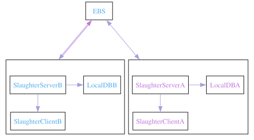
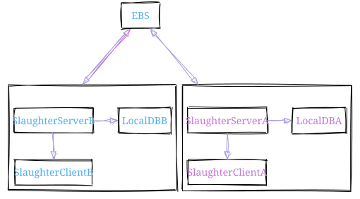
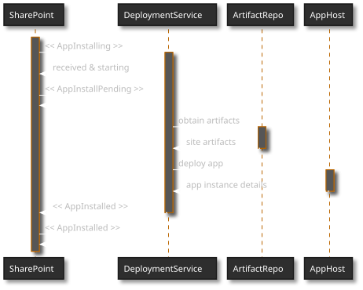
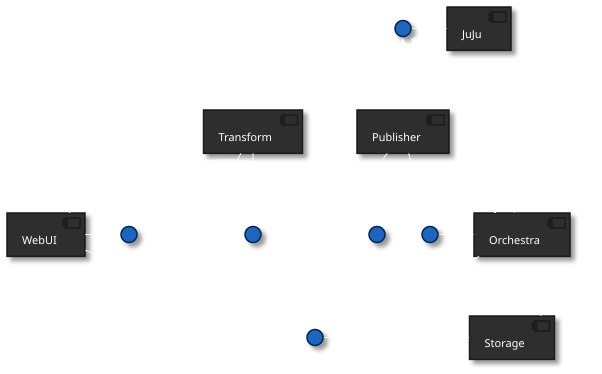
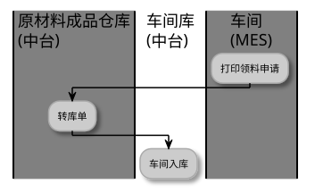
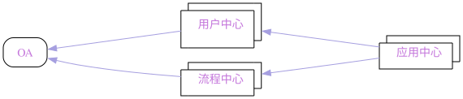
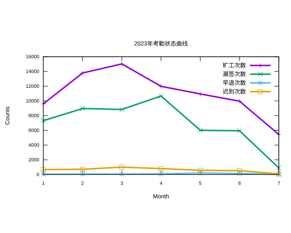
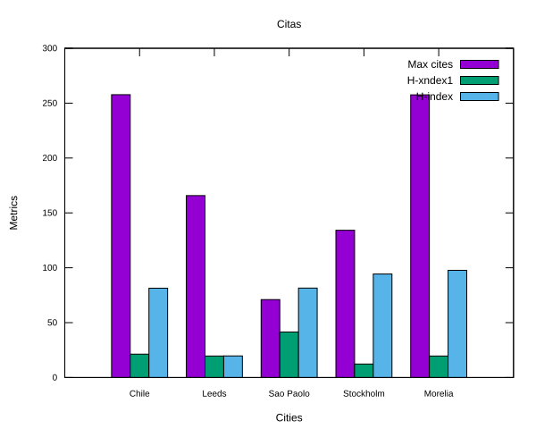

:PROPERTIES:
:ID:       d33b18eb-be5d-4fce-b793-a4d3e51bd915
:END:
#+title: doom org style
#+subtitle: A vairty of template about org mode code which one referenced the doom doc style
#+author: vanniuner
#+OPTIONS: prop:nil timestamp:nil \n:t ^:nil f:t toc:t author:t num:t H:2 tex:t
#+HTML_HEAD: 

# #+HTML_HEAD: 
# #+HTML_HEAD: <link   href = "https://emacs-1308440781.cos.ap-chengdu.myqcloud.com/base.css" rel="stylesheet" type="text/css"></link>
#+HTML_HEAD: 
#+HTML_HEAD: <link href="base.css" rel="stylesheet"></link>
#+LATEX_COMPILER: xelatex
#+LATEX_CLASS: elegantpaper
#+HTML_HEAD: <a href="https://github.com/vanniuner/doom-org-style" class="github-corner" aria-label="View source on GitHub"><svg width="80" height="80" viewBox="0 0 250 250" style="fill:#70B7FD; color:#fff; position: absolute; top: 0; border: 0; right: 0;" aria-hidden="true"><path d="M0,0 L115,115 L130,115 L142,142 L250,250 L250,0 Z"></path><path d="M128.3,109.0 C113.8,99.7 119.0,89.6 119.0,89.6 C122.0,82.7 120.5,78.6 120.5,78.6 C119.2,72.0 123.4,76.3 123.4,76.3 C127.3,80.9 125.5,87.3 125.5,87.3 C122.9,97.6 130.6,101.9 134.4,103.2" fill="currentColor" style="transform-origin: 130px 106px;" class="octo-arm"></path><path d="M115.0,115.0 C114.9,115.1 118.7,116.5 119.8,115.4 L133.7,101.6 C136.9,99.2 139.9,98.4 142.2,98.6 C133.8,88.0 127.5,74.4 143.8,58.0 C148.5,53.4 154.0,51.2 159.7,51.0 C160.3,49.4 163.2,43.6 171.4,40.1 C171.4,40.1 176.1,42.5 178.8,56.2 C183.1,58.6 187.2,61.8 190.9,65.4 C194.5,69.0 197.7,73.2 200.1,77.6 C213.8,80.2 216.3,84.9 216.3,84.9 C212.7,93.1 206.9,96.0 205.4,96.6 C205.1,102.4 203.0,107.8 198.3,112.5 C181.9,128.9 168.3,122.5 157.7,114.1 C157.9,116.9 156.7,120.9 152.7,124.9 L141.0,136.5 C139.8,137.7 141.6,141.9 141.8,141.8 Z" fill="currentColor" class="octo-body"></path></svg></a>
#+begin_quote
样式引用：https://docs.doomemacs.org/latest/#/modules
#+end_quote
#+latex:\newpage
一个类 *doom doc* 的 *org html* 样式模版 [[http://1.117.167.195/doc/doomorgstyle.html][点此预览🪄]]

* 使用
配置 *snippet* 模版，然后在 *org mode* 文件中使用 ~tt~ ~tab~ 就可展开此模版。
#+begin_src org -n
#+HTML_HEAD: 
#+HTML_HEAD: 
#+HTML_HEAD: <link   href = "https://emacs-1308440781.cos.ap-chengdu.myqcloud.com/base.css" rel="stylesheet" type="text/css"></link>
#+OPTIONS: prop:nil timestamp:t \n:t ^:nil f:t toc:t author:t num:t H:2
#+LATEX_COMPILER: xelatex
#+LATEX_CLASS: elegantpaper
#+latex:\newpage
#+end_src

#+begin_notice-info
想使用在线版的静态文件，可以使用下面的配置进行替换
#+end_notice-info

#+begin_src org -n
    #+HTML_HEAD: <link href="https://emacs-1308440781.cos.ap-chengdu.myqcloud.com/org_css.css" rel="stylesheet"></link>
    #+HTML_HEAD: 
    #+HTML_HEAD: 
#+end_src
* 字体样式
#+CAPTION:字体样式说明
| 样式   | 效果                    | 符号 |
| 粗体   | *bold*                  | *    |
| 斜体   | /italic/                | /    |
| 下划线 | _underlinedggwith_    | —    |
| 超连接 | http://neoemacs.com     | auto |
| 中横线 | +strike-through+        | +    |
| 按键   | ~code~                  | ~    |

#+begin_quote
使用符号将字符包围就可得到样式效果
#+end_quote
* 特殊说明
** quote 摘要、引用
可使用`quote`来进行代码块补全，表示摘要，引用
#+begin_quote
TECO - Tape [later text] Editor/COrrector
A combination text editor/really horrible ProgrammingLanguage. To quote the paper "RealProgrammers don't use Pascal" (1983):
#+end_quote

** notice 注意事项、提醒
#+begin_notice-info
你有许多已标记的项目并且你可能错过一个重要的项目时，提醒可以提供帮助
#+end_notice-info

#+begin_notice-warning
Please do not file or answer Doom Emacs issues on Reddit, Twitter, or StackOverflow. Kindly refer them to this section.
#+end_notice-warning

#+begin_notice-example
这是 1 个例子
#+end_notice-example
** Declare a reference
According to the documentation [[https://orgmode.org/manual/Internal-Links.html][Internal-Links]] we know there have two ways to sign a particular tag.
1. the outline of org mode is an natural linkable tag.
2. use <<a particular tag>> to declare a linkable tag.
* 段落及高亮
Example of an @@comment:inline@@ comment.

原文：[[https://iuap.yonyoucloud.com/doc/yonbuilder.html#/md-build/yonbuilder/articles/yonbuilder/1-/notes.md?key=%E5%8F%91%E7%89%88%E8%AF%B4%E6%98%8E][用友 bip 产品功能说明]] ，在说明文档

大数据中 *最宝贵* 、最难以代替的就是数据，一切都围绕数据。

HDFS 是最早的大数据存储系统，存储着宝贵的数据资产，各种新算法、框架要想得到广泛使用，必须支持 HDFS，才能获取已存储在里面的数据。所以大数据技术越发展，新技术越多，HDFS 得到的支持越多，越离不开 HDFS。HDFS 也许不是最好的大数据存储技术，但依然是最重要的大数据存储技术。

HDFS 是如何实现大数据高速、可靠的存储和访问的呢？
 - Hadoop 分布式文件系统 HDFS 的设计目标是管理数以千计的服务器、数以万计的磁盘，将大规模的服务器计算资源当作一个单一存储系统进行管理，对应用程序提供数以 PB 计的存储容量，让应用程序像使用普通文件系统一样存储大规模的文件数据。

#+latex:\newpage
* 表格
~C-c ~~ to convert to tabel.el table
~C-c ~~ to convert to org table
org table ~M-h~ ~M-l~ for move Columns left and right
org table ~M-k~ ~M-j~ for move Rows up and down
#+begin_src txt
# table.el for merge Columns or Rows
#+end_src

#+CAPTION[Short caption]: square
|---+-----+-----+-----+-----------+------------|
| N | N^2 | N^3 | N^4 |   sqrt(n) | sqrt[4](N) |
|---+-----+-----+-----+-----------+------------|
| / |   < |     |   > |         < |          > |
| 1 |   1 |   1 |   1 |         1 |          1 |
| 2 |   4 |   8 |  16 | 1.4142136 |  1.1892071 |
| 3 |   9 |  27 |  81 | 1.7320508 |  1.3160740 |
|---+-----+-----+-----+-----------+------------|

#+CAPTION: student
|---+---------+--------+--------+--------+-------+------|
|   | Student | Prob 1 | Prob 2 | Prob 3 | Total | Note |
|---+---------+--------+--------+--------+-------+------|
| ! |         |     P1 |     P2 |     P3 |   Tot |      |
| # | Maximum |     10 |     15 |     25 |    50 | 10.0 |
| ^ |         |     m1 |     m2 |     m3 |    mt |      |
|---+---------+--------+--------+--------+-------+------|
| # | Peter   |     10 |      8 |     23 |    41 |  8.2 |
| # | Sam     |      2 |      4 |      3 |     9 |  1.8 |
|---+---------+--------+--------+--------+-------+------|
|   | Average |        |        |        |  25.0 |      |
| ^ |         |        |        |        |    at |      |
| $ | max=50  |        |        |        |       |      |
|---+---------+--------+--------+--------+-------+------|

#+CAPTION: long table
#+PLOT: title:"An evaluation of plaintext document formats" transpose:yes type:radar min:0 max:4
| Format            | Fine-grained-control  | Initial Effort        | Syntax simplicity     | Editor Support          | Integrations                  | Ease-of-referencing | Versatility |
|-------------------+-----------------------+-----------------------+-----------------------+-------------------------+-------------------------------+---------------------+-------------|
| Word              | Word^2                | Word^3                | Word^4                | sqrt(Word)              | sqrt(sqrt(Word))              |                   2 |           2 |
| LaTeX             | LaTeX^2               | LaTeX^3               | LaTeX^4               | sqrt(LaTeX)             | sqrt(sqrt(LaTeX))             |                   4 |           3 |
| Org Mode          | Org^2 Mode^2          | Org^3 Mode^3          | Org^4 Mode^4          | sqrt(Org Mode)          | sqrt(sqrt(Org Mode))          |                   4 |           4 |
| Markdown          | Markdown^2            | Markdown^3            | Markdown^4            | sqrt(Markdown)          | sqrt(sqrt(Markdown))          |                   3 |           1 |
| Markdown + Pandoc | (Markdown + Pandoc)^2 | (Markdown + Pandoc)^3 | (Markdown + Pandoc)^4 | sqrt(Markdown + Pandoc) | sqrt(sqrt(Markdown + Pandoc)) |                   3 |           2 |
#+TBLFM: $6=vsum($P1..$P3)::$7=10*$Tot/$max;%.1f::$at=vmean(@-II..@-I);%.1f
#+TBLFM: $2=$1^2::$3=$1^3::$4=$1^4::$5=sqrt($1)::$6=sqrt(sqrt(($1)))
#+latex:\newpage
** AWK 表格
#+name: bbs-list
| aardvark | 555-5553 | 1200/300      | B |
| alpo-net | 555-3412 | 2400/1200/300 | A |
| barfly   | 555-7685 | 1200/300      | A |
| bites    | 555-1675 | 2400/1200/300 | A |
| camelot  | 555-0542 | 300           | C |
| core     | 555-2912 | 1200/300      | C |
| fooey    | 555-1234 | 2400/1200/300 | B |
| foot     | 555-6699 | 1200/300      | B |
| macfoo   | 555-6480 | 1200/300      | A |
| sdace    | 555-3430 | 2400/1200/300 | A |
| sabafoo  | 555-2127 | 1200/300      | C |

#+begin_src awk :stdin bbs-list
/foo/ { print $0 }
#+end_src

#+CAPTION: 筛选出 foo 匹配的行
| fooey   | 555-1234 | 2400/1200/300 | B |
| foot    | 555-6699 | 1200/300      | B |
| macfoo  | 555-6480 | 1200/300      | A |
| sabafoo | 555-2127 | 1200/300      | C |
** 表格自增 ID
The target scope which at the left of equation , @ means row number and $ means column nubmer of increasing from one.
The expression which at the right of equation  , @# stands for the row number of increasing from zero.

| 序号 | 字段名 | 名称       |
|    1 | age    | 年龄       |
|    2 | bir    | 出生年月日 |
#+tblfm: @2..$1=@#-1

#+begin_src txt
#+tblfm: $1=@#-1
#+end_src
~C-c~ ~C-c~ to execute it
* LaTex 公式
#+begin_src txt
$\mbox{需求的价格弹性系数} = \frac{\mbox{需求的变动率}}{\mbox{价格的变动率}}$
#+end_src

$$\mbox{需求的价格弹性系数} = \frac{\mbox{需求的变动率}}{\mbox{价格的变动率}}$$

#+CAPTION: laTex 公式
$$\begin{aligned}
\cos 3\theta & = \cos (2 \theta + \theta) \\
& = \cos 2 \theta \cos \theta - \sin 2 \theta \sin \theta \\
& = (2 \cos ^2 \theta -1) \cos \theta - (2 \sin \theta\cos \theta ) \sin \theta \\
& = 2 \cos ^3 \theta - \cos \theta - 2 \sin ^2 \theta \cos \theta \\
& = 2 \cos ^3 \theta - \cos \theta - 2 (1 - \cos ^2 \theta )\cos \theta \\
& = 4 \cos ^3 \theta -3 \cos \theta
\end{aligned} $$

#+latex:\newpage

在行内显示公式：$S_n = \frac{n}{2} \cdot (a + l) \cdot \sqrt(2)$

或者使用独立公式：

$$\begin{aligned}
S_n &= \frac{n}{2} \cdot (a + l) \\
S_n &= \frac{n}{2} \cdot (2a + (n - 1)d) \\
Sum &= \frac{n}{\sum_{\substack{\begin{array}{l} \text{value} = ready \\ \text{time} \in [week] \end{array}}}\text{dailyPaper.record}}
\end{aligned}$$

* Org 代码
代码片段开启行号，修改 `~/.emacs.d/.local/straight/repos/org/lisp/ox-html.el`
#+begin_src lisp -n 10
  (let* ((code-lines (split-string code "\n"))
	 (code-length (length code-lines))
	 (num-fmt
	  (and num-start
	       (format "%%%ds "
	       (format "%(add-hook 'code-review-mode-hook
          (lambda ()
            ;; include *Code-Review* buffer into current workspace
            (persp-add-buffer (current-buffer))))%%ds: "
#+end_src
** Java 代码
#+begin_src java
    /**
     ,* @param request 调用的请求参数
     ,* @param needLog true 需要记录日志  false 不记录日志
     ,* @return
     ,*/
    protected NcApiResponse runApply(NcApiRequest request, Boolean needLog) {
        NcApiResponse ncApiResponse = null;
        try {
            final NcApiRequest ncApiRequest = executeBefore(request);
            ncApiResponse = executeGetRequest(ncApiRequest);
        } catch (Exception e) {
            afterExecute(needLog, e, request, ncApiResponse);
            if (e instanceof BizException) {
                throw new BizException("NC 提示", ((BizException) e).getErrorMsg(), e);
            } else {
                throw new BizException("NC 异常", e.getMessage());
            }
        }

        return ncApiResponse;
    }
#+end_src

#+latex:\newpage

** babel java
#+begin_src java :results value list
List<Integer> a = Arrays.asList(1, 2);
return a;
#+end_src

#+RESULTS:
- 1
- 2

~C-c~ ~C-c~ to execute it, but export to html will fail when the babel java result generated.
* 图片
** 引用本地图片
#+CAPTION[Short caption]: create by https://excalidraw.com/

** dot
#+BEGIN_SRC dot :file image/dot-graphviz-demo.svg
    digraph G {
        node [shape="box",fontcolor="#4EAEEF"]
        edge [color="#a69fe0" fontcolor=white]
        bgcolor="transparent"
        rankdir = TD
        compound=true

        subgraph clusterD {
            fontcolor=white
            label = "Local";
            SlaughterServerB -> LocalDBB [splines=ortho]
            SlaughterServerB -> SlaughterClientB [minlen=1]
            {rank=same;  SlaughterServerB , LocalDBB }
        }

        subgraph clusterM {
            node [shape="box",fontcolor="#c475db"]
            fontcolor=white
            label = "Local";
            SlaughterServerA -> LocalDBA [splines=ortho ]
            SlaughterServerA -> SlaughterClientA [minlen=1]
            {rank=same;  SlaughterServerA , LocalDBA }
        }
        EBS -> SlaughterServerA [dir=both minlen=2 label="ϟ" lhead="clusterM"][constraint=true];
        EBS -> SlaughterServerB [dir=both,minlen=2,label="ϟ" lhead="clusterD" color="#a69fe0:#c475db"]

    }
#+END_SRC

#+CAPTION: XX 系统 v1.2.3 架构图
#+RESULTS:

** dot sk

#+BEGIN_SRC dotsk :file image/dot-sk-graphviz-demo.svg
digraph G {
    node [shape="box",fontcolor="#4EAEEF"]
    edge [color="#a69fe0" fontcolor=white]
    bgcolor="transparent"
    rankdir = TD
    compound=true

    subgraph clusterD {
        fontcolor=white
        label = "Local";
        SlaughterServerB -> LocalDBB [splines=ortho]
        SlaughterServerB -> SlaughterClientB [minlen=1]
        {rank=same;  SlaughterServerB , LocalDBB }
    }

    subgraph clusterM {
        node [shape="box",fontcolor="#c475db"]
        fontcolor=white
        label = "Local";
        SlaughterServerA -> LocalDBA [splines=ortho ]
        SlaughterServerA -> SlaughterClientA [minlen=1]
        {rank=same;  SlaughterServerA , LocalDBA }
    }
    EBS -> SlaughterServerA [dir=both minlen=2 label="ϟ" lhead="clusterM"][constraint=true];
    EBS -> SlaughterServerB [dir=both,minlen=2,label="ϟ" lhead="clusterD" color="#a69fe0:#c475db"]
}
#+END_SRC

#+CAPTION: 手绘风格的 dot graphviz
#+RESULTS:

** plantuml with style css
plantuml 替换原生样式
DARKO   RANGE/LIGHTORANGE/DARKBLUE/LIGHTBLUE/DARKRED/LIGHTRED/DARKGREEN/LIGHTGREEN
#+begin_src txt
!define LIGHTORANGE
!includeurl C4-PlantUML/juststyle.puml
#+end_src

#+BEGIN_SRC plantuml :file image/plant-uml-order.svg
!define LIGHTORANGE
!includeurl C4-PlantUML/juststyle.puml
skinparam backgroundColor transparent

activate SharePoint
SharePoint -> DeploymentService: << AppInstalling >>
activate DeploymentService
SharePoint <-- DeploymentService: received & starting
SharePoint -> SharePoint: << AppInstallPending >>

DeploymentService -> ArtifactRepo: obtain artifacts
activate ArtifactRepo
DeploymentService <-- ArtifactRepo: site artifacts
deactivate ArtifactRepo

DeploymentService -> AppHost: deploy app
activate AppHost
DeploymentService <-- AppHost: app instance details
deactivate AppHost

SharePoint <-- DeploymentService: << AppInstalled >>
deactivate DeploymentService
SharePoint -> SharePoint: << AppInstalled >>
#+END_SRC

#+CAPTION: 有样式的 plantuml 时序图
#+RESULTS:

** plant uml 系统 Contex 架构图
plantuml 替换原生样式
DARKORANGE/LIGHTORANGE/DARKBLUE/LIGHTBLUE/DARKRED/LIGHTRED/DARKGREEN/LIGHTGREEN
#+begin_src txt
!define LIGHTBLUE
!includeurl C4-PlantUML/juststyle.puml
#+end_src
#+BEGIN_SRC plantuml :file image/plantuml-c4.svg
!define LIGHTBLUE
!includeurl C4-PlantUML/juststyle.puml
    skinparam backgroundColor transparent
    interface "JuJu" as juju
    interface "API" as api
    interface "Storage" as storage
    interface "Transform" as transform
    interface "Publisher" as publisher
    interface "Website" as website

    juju - [JuJu]

    website - [WebUI]
    [WebUI] .up.> juju
    [WebUI] .down.> storage
    [WebUI] .right.> api

    api - [Orchestra]
    transform - [Orchestra]
    publisher - [Orchestra]
    [Orchestra] .up.> juju
    [Orchestra] .down.> storage

    [Transform] .up.> juju
    [Transform] .down.> storage
    [Transform] ..> transform

    [Publisher] .up.> juju
    [Publisher] .down.> storage
    [Publisher] ..> publisher

    storage - [Storage]
    [Storage] .up.> juju
#+END_SRC

#+CAPTION: 系统 Contex 架构图
#+RESULTS:

** 泳道图
#+BEGIN_SRC plantuml :file ./image/plantuml-swiming.svg
!define LIGHTGREEN
!includeurl C4-PlantUML/juststyle.puml
skinparam backgroundColor transparent
|#gray|原材料成品仓库\l(中台)|
|#white|车间库\l(中台)|
|#gray|车间\l(MES)|
:打印领料申请;
|#gray|原材料成品仓库\l(中台)|
:转库单;
|#white|车间库\l(中台)|
:车间入库;

#+END_SRC

#+RESULTS:

** plantuml 通过html自定义图片样式
#+BEGIN_SRC dot -Tpng :file image/oa-center.svg
    digraph G {
        node [shape="box",fontcolor="0xfffff", style=rounded]
        bgcolor="transparent"
        node [shape="box",fontcolor="#c475db"]
        edge [color="#a69fe0",fontcolor=white]
        UserCenter [shape=none margin=0 label=
        <<table border="0" cellspacing="0" cellborder="1">
        <tr>
        <td width="9"  height="9" fixedsize="true" sides="b"></td>
        <td width="81" height="9" fixedsize="true" sides="tl"></td>
        <td width="9"  height="9" fixedsize="true" sides="tr"></td>
        </tr>
        <tr>
        <td width="9"  height="37" fixedsize="true" sides="l"></td>
        <td width="81" height="37" fixedsize="true" sides="t">用户中心</td>
        <td width="9"  height="37" fixedsize="true" sides="lr"></td>
        </tr>
        <tr>
        <td width="9"  height="9" fixedsize="true" sides="lb"></td>
        <td width="81" height="9" fixedsize="true" sides="b"></td>
        <td width="9"  height="9" fixedsize="true" sides="tl"></td>
        </tr>
        </table>>]

        BPMCenter [shape=none margin=0 label=
        <<table border="0" cellspacing="0" cellborder="1">
        <tr>
        <td width="9"  height="9" fixedsize="true" sides="b"></td>
        <td width="81" height="9" fixedsize="true" sides="tl"></td>
        <td width="9"  height="9" fixedsize="true" sides="tr"></td>
        </tr>
        <tr>
        <td width="9"  height="23" fixedsize="true" sides="l"></td>
        <td width="81" height="23" fixedsize="true" sides="t">流程中心</td>
        <td width="9"  height="23" fixedsize="true" sides="lr"></td>
        </tr>
        <tr>
        <td width="9"  height="9" fixedsize="true" sides="lb"></td>
        <td width="81" height="9" fixedsize="true" sides="b"></td>
        <td width="9"  height="9" fixedsize="true" sides="tl"></td>
        </tr>
        </table>>]

        CenterApp [shape=none margin=0 label=
        <<table border="0" cellspacing="0" cellborder="1">
        <tr>
        <td width="9"  height="9" fixedsize="true" sides="b"></td>
        <td width="81" height="9" fixedsize="true" sides="tl"></td>
        <td width="9"  height="9" fixedsize="true" sides="tr"></td>
        </tr>
        <tr>
        <td width="9"  height="23" fixedsize="true" sides="l"></td>
        <td width="81" height="23" fixedsize="true" sides="t">应用中心</td>
        <td width="9"  height="23" fixedsize="true" sides="lr"></td>
        </tr>
        <tr>
        <td width="9"  height="9" fixedsize="true" sides="lb"></td>
        <td width="81" height="9" fixedsize="true" sides="b"></td>
        <td width="9"  height="9" fixedsize="true" sides="tl"></td>
        </tr>
        </table>>]

        rankdir = LR
        OA -> UserCenter [dir=back,minlen=2,label="HTTP API 接口"]
        OA -> BPMCenter [dir=back,minlen=2,label="HTTP API 接口"]
        BPMCenter -> CenterApp [dir=back,minlen=2,label="微服务接口"]
        UserCenter -> CenterApp [dir=back,minlen=2,label="微服务接口"]
    }
#+END_SRC

#+RESULTS:

** plot 折线图
use ~org-plot/gnuplot~ for generate.

#+PLOT: title:"2023年考勤状态曲线" type:2d linetype:4 file:"zxt.svg"
#+PLOT: set:"key right top"
#+PLOT: set:"xlabel 'Month'"
#+PLOT: set:"ylabel 'Counts'"
#+PLOT: set:"xtics font ',10'"
#+PLOT: set:"ytics font ',10'"
#+PLOT: set:"yrange [0:]"
#+PLOT: set:"size ratio 0.5"
#+PLOT: ind:1
#+PLOT: with:"linespoints linewidth 3 pointsize 1.0"
| 月份 | 旷工次数 | 漏签次数 | 早退次数 | 迟到次数 |
|------+----------+----------+----------+----------|
|   01 |     9598 |     7319 |       44 |      673 |
|   02 |    13788 |     8963 |       65 |      719 |
|   03 |    15024 |     8837 |       60 |     1005 |
|   04 |    11977 |    10662 |       92 |      807 |
|   05 |    10942 |     6005 |      191 |      575 |
|   06 |     9958 |     5943 |      142 |      530 |
|   07 |     5443 |      902 |       24 |       89 |

#+CAPTION: 折线图

** plot 柱状图
#+PLOT: title:"Citas" file:"vvt.svg"
#+PLOT: type:2d
#+PLOT: set:"style histogram clustered gap 1"
#+PLOT: set:"style fill solid 1.0 border -1"
#+PLOT: set:"key right top"
#+PLOT: set:"xlabel 'Cities'"
#+PLOT: set:"ylabel 'Metrics'"
#+PLOT: set:"xtics font ',10'"
#+PLOT: set:"ytics font ',10'"
#+PLOT: set:"yrange [0:]"
#+PLOT: with:histograms
#+PLOT: ind:1
| Sede      | Max cites | H-xndex1 | H-index |
|-----------+-----------+----------+---------|
| Chile     |    257.72 |     21.3 |   81.39 |
| Leeds     |    165.77 |     19.6 |   19.68 |
| Sao Paolo |     71.00 |     41.5 |   81.50 |
| Stockholm |    134.19 |     12.3 |   94.33 |
| Morelia   |    257.56 |     19.6 |   97.67 |

** WHAT IS CONNECTOR
#+begin_src ds2 :file test.svg
direction: right
style.fill : transparent
platform : BPM

platform -> RocketMq: invoke  {
  style.animated: true
}
platform -> API: interface/http/https  {
  style.animated: true
}
platform -> DataBase: DB_Link  {style.animated: true}
RocketMq: {
shape: image
icon: https://upload.wikimedia.org/wikipedia/commons/thumb/8/89/Apache_RocketMQ_logo.svg/130px-Apache_RocketMQ_logo.svg.png?20210417072453
width: 10
style: {
    stroke: green
    font-color: green
    fill: white
  }
}

DataBase: {
shape: image
icon: https://cdn.icon-icons.com/icons2/1508/PNG/512/mysqlworkbench_103806.png
width: 20
}

API.style.multiple: true

RocketMq -> System : belong{
 style.animated: true
 style.stroke: "#53C0D8"
}
API -> System : belong{
 style.animated: true
 style.stroke: "#53C0D8"
}
DataBase -> System : belong{
 style.animated: true
 style.stroke: "#53C0D8"
}

#+end_src

#+RESULTS:

** d2 workflow
#+begin_src d2 :file devflow.svg
    direction: right
    style.fill : transparent

    "禅道需求": "需求-PRD"{
    shape: image
    icon: https://pp.myapp.com/ma_icon/0/icon_54212284_1655281546/256
    width: 60
    height: 60
    }
    产品经理: "产品" {
    shape: person
    width: 52
    height: 54
    style.fill: "#85929E"
    style.stroke: "#01020d"
    style.stroke-width: 1
    }

    产品经理 -> 禅道需求 : 创建  {
    #style.animated: true
    style.stroke-width: 3
    style.stroke: "#F4D03F"
    }

    禅道需求 -> development : 负责人分配  {
    #style.animated: true
    style.stroke-width: 3
    style.stroke: "#F4D03F"
    }

    development: "研发" {
    shape: person
    width: 52
    height: 54
    style.fill: "#4b9ae5"
    style.stroke-width: 1
    }
    概要设计: "DOC\n概要设计" {
    shape: page
    width: 59
    height: 94
    style.fill: transparent
    style.fill: "gray"
    style.stroke-width: 1
    }
    development -> 概要设计 : output  {
    #style.animated: true
    }
    方案评审: "评审会议" {
    icon: https://cdn-icons-png.flaticon.com/512/1324/1324843.png
    shape: image
    height: 124
    height: 124
    }
    概要设计 -> 方案评审
    # development -> 方案评审 : Meeting  {
    #   #style.animated: true
    #   # style.stroke-width: 3
    #   style.stroke: "#F4D03F"
    # }
    排期表 : "排期表"{
    icon: https://icons.terrastruct.com/essentials/092-graph%20bar.svg
    shape: image
    }
    方案评审 -> 排期表 : output{
    }

    研发迭代 <- 排期表 : development {
    #style.animated: true
    style.stroke-width: 3
    }
    测试: "测试" {
    shape: person
    width: 52
    height: 54
    style.fill: "#EB984E"
    style.stroke: "#01020d"
    style.stroke-width: 1
    }

    测试 <- 研发迭代 : 提测{
    style.stroke-width: 3
    }
    dev : "dev 环境"{
    shape: cloud
    style.fill: "#58D68D"
    style.stroke: "#2ECC71"
    style.font-color: "white"

    }
    研发迭代 : "研发迭代" {
    style.3d: true
    }

    研发迭代 -> dev : 自测

    禅道缺陷 : "BUG"{
    shape: image
    icon: https://pp.myapp.com/ma_icon/0/icon_54212284_1655281546/256
    width: 60
    height: 60
    }
    测试 -> 禅道缺陷 : 提交bug {
    style.animated: true
    style.stroke-width: 3
    style.stroke: "red"
    }
    禅道缺陷 -> development : 分配 {
    style.animated: true
    style.stroke-width: 3
    }
    development -> 测试 : 解决bug{
    style.animated: true
    style.stroke-width: 3
    }
    #+end_src
* org 转 Word
#+begin_src shell
pandoc -o ~/Desktop/out.docx ~/.doom.d/README.org
#+end_src

* 插入时间
| ~C-c .~ | 插入当前时间 <2023-02-25 Sat> |
| ~K~     | lask week                     |
| ~J~     | next week                     |
| ~L~     | next day                      |
* Unicode 字符
Use unicode character could express of what you think more directly,cause an image symbol alway make the understanding more clearly.
Here are some unicode website of listing those character,✌
https://unicode.yunser.com/common
https://cn.piliapp.com/symbol/
